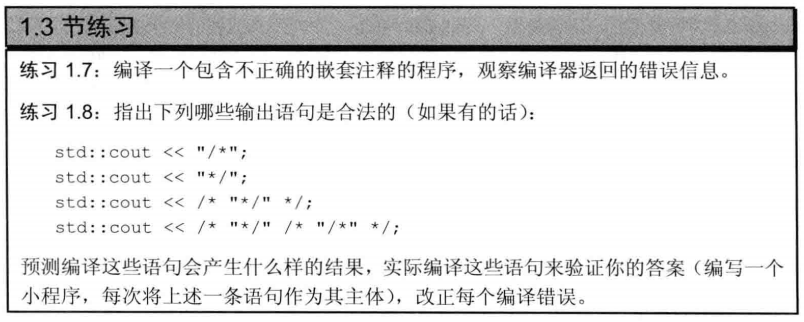

> ;
***
1.7: 
```cpp
/**/*/
int main() {
    return 0;
}
``` 
The compiler told me that:  

    ex_1_7.cpp:2:2: error: expected unqualified-id before ‘/’ token*/
                     ^    
    ex_1_7.cpp:2:2: error: expected constructor, destructor, or type conversion before ‘/’ token
***
1.8:
按顺序1~4,可知: 1,2,4正确.
第三行应该为:
```cpp
std::cout << /* "*/" */ ";
```

